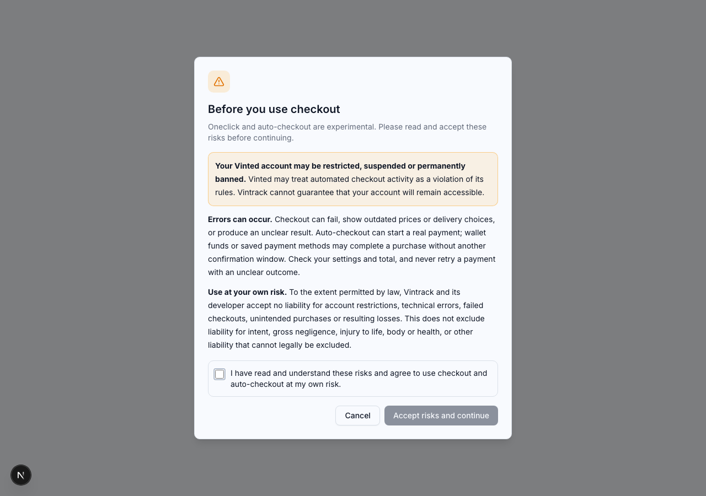

# Checkout risk warning

Release 0.3.0 requires every member, including administrators and existing
linked accounts, to accept the checkout risk warning before using Oneclick or
auto-checkout. Existing payment opt-ins do not count as this acceptance.

The overlay warns about Vinted account restrictions and permanent bans,
technical errors, outdated prices or shipping choices, unclear outcomes and
unintended payments. It states that members use these features at their own
risk and that Vintrack and its developer accept no liability to the extent
permitted by law. Intent, gross negligence, injury to life/body/health and other
mandatory liability remain excepted. This is a product warning, not a promise
that any liability exclusion is legally enforceable. See
[BGB § 309 no. 7](https://www.gesetze-im-internet.de/bgb/__309.html).

The checkbox starts unchecked; the confirmation button stays disabled until
it is checked. Cancel or Escape ends the pending checkout. The dialog cannot be
dismissed by clicking outside it. Saving failures keep it open and do not start
checkout. The scrollable warning body and fixed buttons also work on mobile.
If a buy link already uses auto-checkout, the overlay explicitly says that
continuing may start a real payment.

Acceptance is stored on the signed-in Vintrack user with warning version and a
server timestamp. It is independent of account-link changes and payment
preferences, and is never inferred from local storage or a previous auto-payment
opt-in. A changed warning version requires acceptance again. Keep
`CHECKOUT_RISK_WARNING_VERSION` in Control Center and
`checkoutRiskWarningVersion` in the Vinted service in sync.

## Enforcement and latency

- Dashboard buttons and notification handoffs share the same consent prompt.
  Hidden notification pages still wait for visibility before showing it.
- Switching auto-checkout on in Account opens the risk overlay immediately,
  including for members who previously accepted it for Oneclick. The switch
  stays off until acceptance; Cancel or Escape leaves it off. The separate
  payment warning and price limit still need confirmation before saving.
- Unaccepted GET handoffs return a read-only preview with HTTP 403 and
  `CHECKOUT_CONSENT_REQUIRED`, so older frontends cannot start checkout.
- Prepare POSTs, browser payment claims, legacy buy/warm endpoints, saved
  checkout-link access and auto-checkout preference saves are guarded.
- The Vinted service independently reads persisted consent before handling
  checkout endpoints; missing storage fails closed.
- Already accepted members require no extra client request. Consent is read in
  the same database query as their checkout preferences. After first acceptance,
  the target is reloaded before continuing so current saved choices apply.
- No Vinted checkout request or payment claim is sent while the prompt is
  pending. No real user consent or real payment was submitted during testing.

## Database and validation

Migration `20261005210000_add_checkout_risk_consent` adds
`User.checkout_risk_version` (default 0) and
`User.checkout_risk_accepted_at` (nullable). There is no acceptance backfill.
The normal deployment migration job must run before the updated services.
The migration has been applied to the local development database.

Validated with Control Center unit tests and checkout E2E on desktop/mobile,
ESLint, production build and `go test ./...` in the Vinted service. E2E uses
synthetic accounts, API fixtures and intercepted external navigation.

[Mobile warning](screenshots/checkout-risk-mobile-chrome.png).

[Account switch warning](screenshots/checkout-risk-account-toggle.png): locally
verified that switching on opens the overlay and cancelling leaves the mode off,
without saving user consent or payment preferences.
