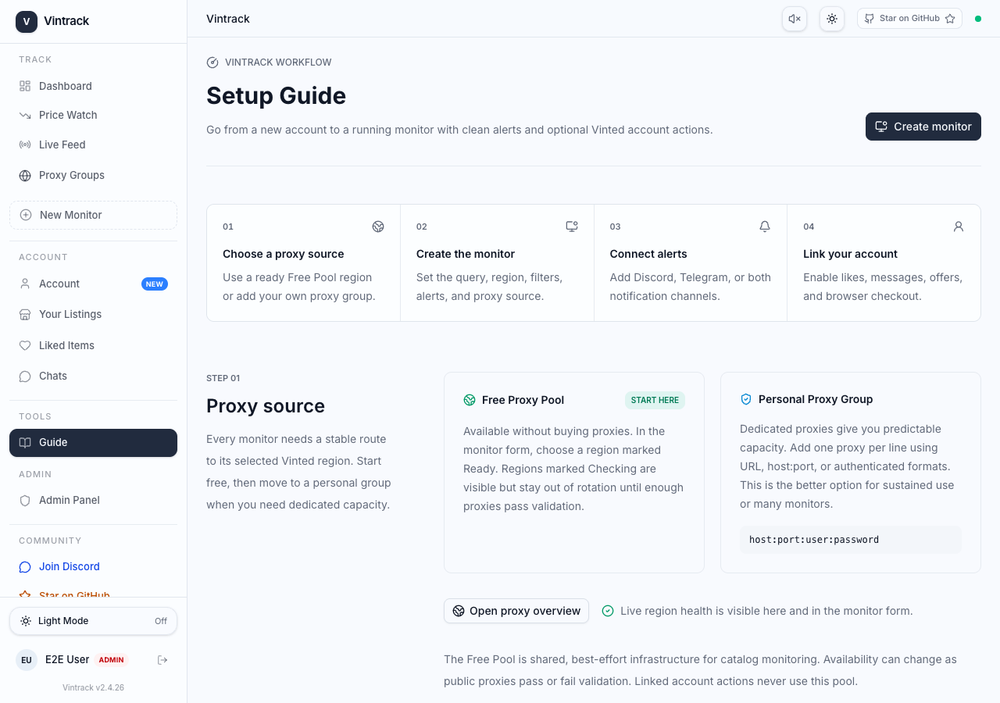
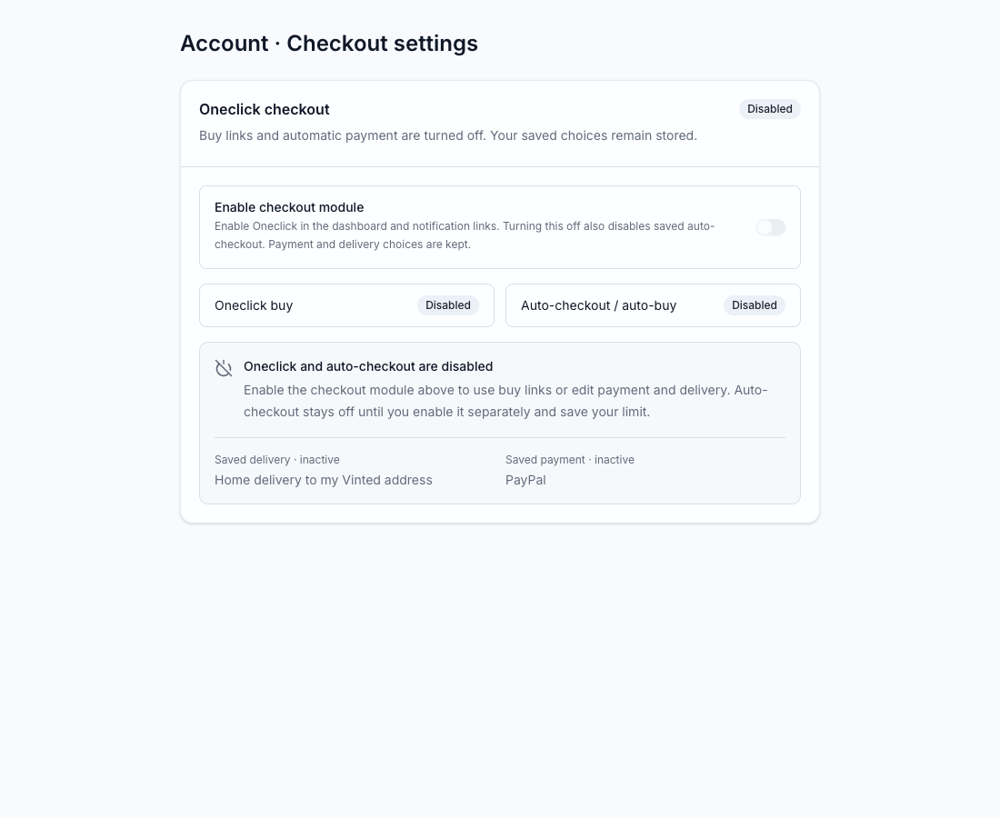

# Vintrack 2.5.0 · Oneclick checkout

Chrome and Firefox extension version: **0.3.2**, checkout protocol **6**.

## Member experience

- Linked members can enable the checkout module in Account after explicitly
  accepting the account-ban, error and payment-risk warning.
- Dashboard carts and prominent notification links share Oneclick: apply saved
  regional delivery/payment choices and open Vinted's final review.
- Optional PayPal and saved-card auto-checkout require a separate payment
  warning and an EUR total limit. A link click can start a real payment; monitor
  matches alone never buy. Saved cards can charge immediately.
- The Account card shows saved Enabled/Disabled states. When the module is off,
  payment/delivery fields are replaced by inactive summaries. Unsaved changes
  do not falsely indicate that an active auto-checkout setting is disabled.
- Account has a New badge until the member first visits the page. A versioned
  PostgreSQL field remembers this across browsers/devices. A visit acknowledges
  the announcement only; it does not enable checkout or accept any warning.

Fast preparation reuses the first ready regional Vinted tab, skips product-page
navigation and performs independent local reads concurrently. Cold starts still
need a Vinted browser context. Identity checks, explicit consent, price limits,
wallet checks and durable payment claims remain enforced. Unknown payment
outcomes never retry automatically. No new end-to-end timing was measured for
0.3.2. Regional/provider availability still comes from Vinted; see
[payment regions](../checkout-payment-regions.md),
[PayPal limits](../checkout-auto-paypal.md) and
[saved-card limits](../checkout-auto-card.md).

## Rollout

Four additive Prisma migrations run through the existing migration service
before the updated apps: checkout preferences, risk consent, checkout module
switch, and Account announcement acknowledgment. Existing members start with
checkout off and no accepted warning; there is no consent or auto-payment
backfill. The announcement field defaults to 0, so existing members discover
the new settings once.

App package and lockfile are 2.5.0. Both manifests, the development package,
the Chrome release ZIP, `.env.example`, Compose and Account's latest-version
fallback are 0.3.2. Set the GitHub repository variable
`BROWSER_EXTENSION_LATEST_VERSION=0.3.2` before merging. CI validates all source
defaults; the release version job checks the GitHub variable before images or
deployment. `BROWSER_EXTENSION_MIN_VERSION=0.2.1` intentionally remains unchanged
for session/companion compatibility. Checkout capabilities are checked
separately; card auto-checkout requires protocol 6 (extension 0.3.1 or later).

Merge the reviewed feature PR to main. The existing Release and Deploy workflow
builds/pushes all three app images, applies migrations, updates production and
publishes the Chrome ZIP on release v2.5.0. Firefox 0.3.2 is submitted to AMO;
public availability depends on Mozilla review. Do not relabel an older ZIP or
publish an unsigned Firefox package as an installable download.

## Validation

- `go test ./...` in worker and vinted-service.
- Dashboard lint, Docker production build and 56 unit tests.
- Checkout browser tests and Account badge tests on desktop/mobile, including
  acknowledgment across independent browser contexts.
- Extension package validation: 60 tests; Firefox `web-ext@10 lint` has no
  errors, warnings or notices.
- OpenAPI lint passes with existing specification warnings.

